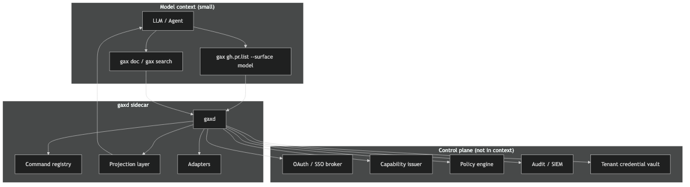

# GAX — Governed Agent eXecution

<p align="center">
  <strong>CLI ergonomics for AI agents · MCP-class governance · structured envelopes</strong>
</p>

<p align="center">
  <a href="https://github.com/0sparsh2/GAX/actions/workflows/ci.yml"></a>
</p>

<p align="center">
  <a href="docs/acsp/">ACSP Protocol</a> ·
  <a href="research/">Research</a> ·
  <a href="eval/">Evaluation</a> ·
  <a href="mcp_vs_cli_benchmarks_2026/report.md">Benchmarks</a>
</p>

---

## Table of contents

- [What is GAX?](#what-is-gax)
- [Why GAX exists](#why-gax-exists)
- [The problem: MCP vs CLI](#the-problem-mcp-vs-cli)
- [The solution](#the-solution)
- [Architecture](#architecture)
- [How it works](#how-it-works)
- [Evaluation](#evaluation)
- [Adapters](#adapters)
- [Installation](#installation)
- [How to use](#how-to-use)
- [Protocol & envelope](#protocol--envelope)
- [Repository structure](#repository-structure)
- [Research & benchmarks](#research--benchmarks)
- [Development](#development)
- [Roadmap](#roadmap)
- [License](#license)

---

## What is GAX?

**GAX** (Governed Agent eXecution) is an open protocol and reference implementation for how AI agents should call external tools. It gives agents a **command-line-shaped surface** (`gax gh.pr.list --repo org/api`) while moving **OAuth, policy, audit, and tenancy** into a **sidecar** the model never sees.

The formal protocol name is **ACSP** (Agent Capability Shell Protocol). This repository contains:

| Component | Path | Description |
|-----------|------|-------------|
| **Reference implementation** | [`gax/`](gax/) | Python package: `gax` CLI + `gaxd` daemon (v0.4) |
| **ACSP specification** | [`docs/acsp/`](docs/acsp/) | [ACSP-1.0](docs/acsp/ACSP-1.0.md) (implementation-agnostic) + envelope, discovery |
| **Research hub** | [`research/`](research/) | MCP vs CLI analysis, diagrams, comparisons |
| **Evaluation harness** | [`eval/`](eval/) | Reproducible CLI / MCP / GAX benchmarks |
| **Deep research** | [`mcp_vs_cli_benchmarks_2026/`](mcp_vs_cli_benchmarks_2026/) | Cited benchmark synthesis |

GAX is **not** “MCP or CLI.” It is a **third surface**: one runtime, registered commands, capability tokens on every invoke, and lazy discovery so you do not pay a 40k+ token schema tax up front.

---

## Why GAX exists

AI agents need to act on GitHub, Kubernetes, SaaS APIs, and internal systems. Two dominant patterns exist today:

| Approach | Strength | Weakness |
|----------|----------|----------|
| **Raw CLI** (`gh`, `kubectl`, `aws`) | Token-efficient, composable, models already know shells | Ambient credentials, weak audit, no per-user OAuth at scale |
| **MCP** (Model Context Protocol) | Typed tools, OAuth, multi-tenant governance | Naive setups inject **full tool schemas** every turn (44k–150k+ tokens) |

Independent benchmarks ([Scalekit](https://www.scalekit.com/blog/mcp-vs-cli-use), [Anthropic](https://www.anthropic.com/engineering/code-execution-with-mcp), [Cloudflare Code Mode](https://blog.cloudflare.com/code-mode-mcp/)) show:

- **4×–32×** more tokens for naive MCP vs CLI on the same GitHub tasks  
- **~28%** MCP run failures (infrastructure timeouts) in one 75-run study  
- Optimized MCP (lazy discovery, code mode) **closes the token gap** but does not standardize caps, per-invoke audit, or shell ergonomics in one product

**GAX exists to combine:**

- CLI-level **token economics** (lazy `gax search` / `gax doc`, not full schema preload)  
- MCP-level **governance** (OAuth device flow, capability tokens, policy, audit)  
- Automation-grade **structured output** (Envelope v1 with `audit_id`, schema URI, optional `next` hints)

---

## The problem: MCP vs CLI

```text
Naive MCP agent context:
┌─────────────────────────────────────────────┐
│  System prompt                              │
│  + 43 GitHub MCP tool schemas  (~44k tok)   │  ← paid every session
│  + user message                             │
│  + tool results                             │
└─────────────────────────────────────────────┘

CLI agent context:
┌─────────────────────────────────────────────┐
│  System prompt + short shell rules          │
│  + gh pr list --repo org/api   (~1–3k tok)  │
└─────────────────────────────────────────────┘
```

**Hybrid** (use CLI locally + MCP in production) works but doubles operational complexity: two auth models, two output shapes, two discovery stories.

---

## The solution

GAX **splits three planes**:

| Plane | Visible to the model? | Responsibility |
|-------|------------------------|----------------|
| **Invocation** | Yes | Short commands: `gax <command> [args]` |
| **Control** | No | OAuth, vault, policy, capability mint/revoke |
| **Data** | Filtered | Envelope v1 JSON; `surface=model` truncates for the LLM |

**Five invariants:**

1. **Lazy discovery** — `gax search`, `gax doc`, `gax schema` (~80–250 tokens each), never full registry in context  
2. **Capability per invoke** — JWT or macaroon (`GAX_CAP` / `GAX-Capability` header); fail closed  
3. **Uniform envelope** — every response: `ok`, `cmd`, `audit_id`, `data`, `meta`, optional `next`  
4. **No arbitrary shell** — only registered commands (policy + allowlists)  
5. **Composable plans** — `gax plan run workflow.yaml` (sequential + parallel steps, one envelope out)

MCP servers and existing CLIs become **adapters** behind stable GAX command names—the agent never sees MCP tool schemas.

---

## Architecture



```text
┌──────────────┐     short commands      ┌──────────────┐
│  LLM / Agent │ ───────────────────────▶│  gax CLI     │
└──────────────┘                         └──────┬───────┘
                                                │ HTTP + GAX-Capability
                                                ▼
                                         ┌──────────────┐
                                         │    gaxd      │
                                         │  (sidecar)   │
                                         ├──────────────┤
                                         │ Registry     │
                                         │ Policy OPA   │
                                         │ Projection   │
                                         │ Audit / OTEL │
                                         └──────┬───────┘
                    ┌──────────────────────────┼──────────────────────────┐
                    ▼                          ▼                          ▼
              ┌──────────┐              ┌──────────┐              ┌──────────┐
              │ exec     │              │ mcp      │              │ http     │
              │ (gh, …)  │              │ bridge   │              │ OpenAPI  │
              └──────────┘              └──────────┘              └──────────┘
```

**Invocation flow:** [research/diagrams/png/sequence-invoke.png](research/diagrams/png/sequence-invoke.png) · [Full architecture doc](research/03-architecture.md)

| Component | Role |
|-----------|------|
| `gax` | Client CLI; discovery, auth, invoke, plans |
| `gaxd` | HTTP sidecar on `127.0.0.1:9477` (default) |
| `manifests/*.yaml` | Command registry: adapter, scopes, schemas |
| `~/.gax/` | Config, OAuth tokens, audit log, vault |

---

## How it works

1. **Register commands** in `gax/manifests/` (YAML) or generate from OpenAPI: `gax openapi generate spec.json`  
2. **Start sidecar:** `gaxd start`  
3. **Authenticate:** `gax auth login` (OAuth device flow) or `gax auth cap-mint` (dev JWT/macaroon)  
4. **Mint capability:** `export GAX_CAP="$(gax auth cap-from-oauth --export | sed 's/export GAX_CAP=//')"`  
5. **Discover (low tokens):** `gax search "pull requests"` → `gax doc gh.pr.list`  
6. **Invoke:** `gax gh.pr.list --repo octocat/Hello-World --surface model`  
7. **Audit:** every invoke gets `audit_id` in `~/.gax/audit.jsonl` (+ optional OTEL export)

**Example envelope (model surface):**

```json
{
  "v": 1,
  "ok": true,
  "cmd": "gh.pr.list@1.0.0",
  "audit_id": "aud_0b20bea710fe48fc",
  "surface": "model",
  "schema": "https://schemas.gax.dev/gh/pr.list/v1",
  "data": { "items": [ { "number": 42, "title": "…", "state": "OPEN" } ] },
  "meta": { "truncated": true, "row_count": 10, "duration_ms": 355 },
  "next": [
    {
      "cmd": "gh.pr.view",
      "args": { "repo": "octocat/Hello-World", "number": 42 },
      "reason": "inspect first PR in list"
    }
  ]
}
```

---

## Evaluation

Reproducible harness: **18 tasks** (happy path, errors, policy denial, truncation, multi-turn, plan failure, MCP bridge). Token counts use **tiktoken** (`cl100k_base`), not hardcoded estimates.

**Bias disclosure:** GAX is our implementation. We report **separate metrics** (median tokens, success rate, audit-id rate, structured-envelope rate) — no team-chosen weighted composite. See [eval/METHODOLOGY.md](eval/METHODOLOGY.md).

| Modality | What it measures |
|----------|------------------|
| `cli` | Shell command + stdout in agent transcript |
| `mcp_naive_43` | Same work + ~44k schema tax (Scalekit fixture) |
| `mcp_live` | Optional real `tools/list` size (`--live-mcp`) |
| `gax` | `gax doc` stub + envelope v1 |
| `gax_mcp_bridge` | Envelope over MCP tool (schema not in prompt) |

**Latest live run** ([summary](eval/results/live-run-summary.md)):

| Modality | Median tokens | Audit-id rate |
|----------|---------------|---------------|
| cli | 104 | 0% |
| gax | 137 | 80% |
| gax_mcp_bridge | 732 | 100% |
| mcp_live (26-tool GitHub server) | 4,483 | 0% |
| mcp_naive_43 (Scalekit fixture) | 44,062 | 0% |

*Details:* [`eval/results/comparison.md`](eval/results/comparison.md) · **Case study:** [eval/case_study/README.md](eval/case_study/README.md)

### Run evaluation locally

```bash
pip install -r eval/requirements.txt
cd gax && python3 -m venv .venv && source .venv/bin/activate
pip install -e ".[dev]"

# Put GITHUB_TOKEN in repo-root .env (gitignored) or export it
python ../eval/run_full.py
python ../eval/run_comparison.py --live-mcp
python ../eval/case_study/run_case_study.py
```

Independent references: [mcp_vs_cli_benchmarks_2026/report.md](mcp_vs_cli_benchmarks_2026/report.md) · [research/10-evaluation.md](research/10-evaluation.md)

---

## Adapters

GAX commands map to backends via the `adapter` field in each manifest.

| Adapter | Purpose | Example commands |
|---------|---------|------------------|
| **`exec`** | Wrap existing CLIs | `gh.pr.list`, `gh.pr.view` (uses `gh` subprocess; `GH_TOKEN` from OAuth) |
| **`mcp`** | One MCP tool per GAX command (schema stays in sidecar) | `mcp.github.list_pulls` |
| **`http`** | OpenAPI-generated GET calls | `pet.findpetsbystatus` (from `gax openapi generate`) |
| **`mock`** | Tests & demos without credentials | `demo.echo`, `kubectl.get.pods`, `aws.s3.list`, `jira.issue.get` |

### Adding a command

Create `gax/manifests/my.command.yaml`:

```yaml
command: my.command
version: "1.0.0"
description: What this command does
category: myapp
adapter: mock   # or exec | mcp | http
required_scopes:
  - myapp:read
side_effects: read
input_schema:
  type: object
  properties:
    id: { type: string }
output_schema:
  type: object
```

Restart `gaxd` or use `gax --local`.

### MCP bridge

Expose a single MCP tool without loading all tool schemas into the agent:

```yaml
adapter: mcp
mcp:
  server_command: npx
  server_args: ["-y", "@modelcontextprotocol/server-github"]
  tool_name: list_pull_requests
```

```bash
export GITHUB_TOKEN=...
gax mcp.github.list_pulls --repo octocat/Hello-World --surface model
```

### OpenAPI → manifests

```bash
gax openapi generate examples/petstore-openapi.json --prefix pet --adapter mock
```

---

## Installation

**Requirements:** Python 3.10+

```bash
git clone https://github.com/0sparsh2/GAX.git
cd GAX/gax

python3 -m venv .venv
source .venv/bin/activate   # Windows: .venv\Scripts\activate
pip install -e ".[dev]"

# Optional: OS keychain for OAuth tokens
pip install -e ".[keyring]"
```

Verify:

```bash
gax --help
gaxd --help
pytest -q
```

---

## How to use

### 1. Start the sidecar

```bash
gaxd start                    # foreground
gaxd start --background       # background (pid in ~/.gax/gaxd.pid)
gaxd start --host 0.0.0.0     # hosted (put TLS on gateway)
```

### 2. Development capabilities (no OAuth)

```bash
export GAX_CAP="$(gax auth cap-mint \
  --command demo.echo \
  --command gh.pr.list \
  --command gh.pr.view \
  --scope demo:echo \
  --scope github:pull_request:read \
  --export | sed 's/export GAX_CAP=//')"
```

Macaroon-style cap: add `--macaroon`.

### 3. Production OAuth (GitHub)

1. Create a GitHub OAuth App with **Device Flow** enabled  
2. `export GAX_GITHUB_CLIENT_ID=Ov23li...`  
3. `gax auth login --tenant acme-corp`  
4. `export GAX_CAP="$(gax auth cap-from-oauth --export | sed 's/export GAX_CAP=//')"`

### 4. Discover & invoke

```bash
gax search "pull request"
gax doc gh.pr.list
gax schema gh.pr.list

gax gh.pr.list --repo octocat/Hello-World --limit 5 --surface model
gax gh.pr.view --repo octocat/Hello-World --number 1
gax demo.echo --message hello
```

### 5. Multi-step plans

```bash
gax plan run examples/plan-demo.yaml      # list PRs → view first
gax plan run examples/plan-parallel.yaml  # parallel demo.echo branches
```

### 6. Vault, compliance, policy

```bash
gax vault put api_key "secret-value" --tenant acme
gax vault get api_key --tenant acme

gax compliance export --format csv    # ~/.gax/exports/audit_soc2.csv
gax compliance export --format json

# Policy: gax/config/policy.yaml + optional OPA (config/policy.rego)
```

### 7. In-process (no gaxd)

```bash
gax --local demo.echo --message "no daemon"
```

### Environment variables

| Variable | Purpose |
|----------|---------|
| `GAX_CAP` | Capability JWT or macaroon |
| `GAX_HOST` / `GAX_PORT` | gaxd address (default `127.0.0.1:9477`) |
| `GAX_GITHUB_CLIENT_ID` | OAuth device flow |
| `GITHUB_TOKEN` | Used by `gh` exec adapter / MCP GitHub server |
| `GAX_HASHICORP_VAULT_ADDR` | Optional Vault backend for `gax vault` |
| `GAX_SPIFFE_ID` | Workload identity metadata in audit |
| `GAX_OTEL_STDOUT=1` | Emit OTEL-shaped logs to stdout |

### CLI reference

| Command | Description |
|---------|-------------|
| `gaxd start` / `stop` / `status` | Sidecar lifecycle |
| `gax auth login` | OAuth device flow |
| `gax auth cap-mint` | Mint dev capability |
| `gax auth cap-from-oauth` | Capability from stored OAuth |
| `gax auth status` | List stored tokens |
| `gax search` / `doc` / `schema` | Lazy discovery |
| `gax run <cmd>` | Explicit invoke |
| `gax <cmd>` | Shorthand for registered commands |
| `gax plan run <file>` | DAG-style workflows |
| `gax openapi generate` | OpenAPI → manifests |
| `gax vault put/get` | Tenant secrets |
| `gax compliance export` | Audit export |

HTTP API: `POST /invoke`, `GET /search?q=`, `GET /commands/{id}/doc`, `GET /health` — see [gax/README.md](gax/README.md).

---

## Protocol & envelope

| Doc | Topic |
|-----|--------|
| [docs/acsp/protocol.md](docs/acsp/protocol.md) | ACSP overview |
| [docs/acsp/envelope-v1.md](docs/acsp/envelope-v1.md) | Response envelope |
| [docs/acsp/discovery.md](docs/acsp/discovery.md) | search / doc / schema |
| [gax/schemas/envelope.v1.json](gax/schemas/envelope.v1.json) | JSON Schema |

**Surfaces:** `model` (truncated for LLM), `human` (TTY), `full` (automation).

**Exit codes:** `0` ok · `2` policy denied · `3` invalid cap · `4` not found · `5` adapter error

---

## Repository structure

```text
GAX/
├── README.md                 ← you are here
├── LICENSE
├── gax/                      ← Python reference implementation
│   ├── gax/                  ← package source (cli, daemon, adapters, …)
│   ├── manifests/            ← command registry (YAML)
│   ├── config/               ← OAuth providers, policy.yaml, policy.rego
│   ├── schemas/              ← envelope.v1.json
│   ├── examples/             ← plans, OpenAPI samples
│   └── tests/
├── docs/acsp/                ← protocol specification
├── eval/                     ← CLI vs MCP vs GAX benchmarks
│   ├── run_comparison.py
│   ├── run_full.py
│   └── results/
├── research/                 ← background, architecture, comparisons
│   └── diagrams/png/         ← architecture diagrams
├── mcp_vs_cli_benchmarks_2026/
│   ├── report.md             ← cited benchmark synthesis
│   └── results/*.json
└── deep-research/            ← phased research skill (outline → JSON → report)
```

---

## Research & benchmarks

| Resource | Description |
|----------|-------------|
| [research/README.md](research/README.md) | Research index |
| [research/01-background-mcp-vs-cli.md](research/01-background-mcp-vs-cli.md) | Why MCP vs CLI matters |
| [research/02-gax-proposal.md](research/02-gax-proposal.md) | GAX thesis |
| [research/05-comparison-matrix.md](research/05-comparison-matrix.md) | CLI / MCP / GAX matrix |
| [mcp_vs_cli_benchmarks_2026/report.md](mcp_vs_cli_benchmarks_2026/report.md) | Deep research report (Scalekit, Anthropic, Cloudflare) |
| [research/11-project-completion.md](research/11-project-completion.md) | Project summary |

Primary external benchmarks:

- [Scalekit — MCP vs CLI](https://www.scalekit.com/blog/mcp-vs-cli-use) (4×–32× tokens, 28% MCP timeouts)  
- [Anthropic — Code execution with MCP](https://www.anthropic.com/engineering/code-execution-with-mcp) (~98.7% token reduction example)  
- [Cloudflare — Code Mode](https://blog.cloudflare.com/code-mode-mcp/) (~1k vs ~1.17M tokens)

---

## Development

```bash
cd gax
source .venv/bin/activate
pip install -e ".[dev]"

pytest -q                           # unit tests
python ../eval/run_full.py          # tests + eval

# Regenerate diagram PNGs
cd ../research/diagrams
for f in *.mmd; do
  npx -y @mermaid-js/mermaid-cli@11 -i "$f" -o "png/${f%.mmd}.png" -b transparent
done
```

Validate deep-research JSON:

```bash
python ../deep-research/scripts/validate_json.py \
  -f ../mcp_vs_cli_benchmarks_2026/fields.yaml \
  -j ../mcp_vs_cli_benchmarks_2026/results/*.json
```

---

## Roadmap

| Phase | Status | Highlights |
|-------|--------|------------|
| **0** Prototype | Working | Envelope, gaxd, manifests, JWT caps |
| **1** Hardening | Working | OAuth, plans, macaroons, eval v2 |
| **2** Ecosystem | Mixed | MCP bridge (prototype); kubectl/aws/jira (stub) |
| **3** Enterprise | Mostly stub | Vault/SPIFFE/OPA hooks; compliance export (prototype) |

**Post-MVP:** MCP connection pooling · real kubectl/aws/jira exec adapters · provider-native token APIs · hosted SSO gateway

Full checklist: [research/06-implementation-roadmap.md](research/06-implementation-roadmap.md)

---

## License

[MIT](LICENSE)

---

## Contributing

See [CONTRIBUTING.md](CONTRIBUTING.md) — adapters, eval tasks, manifests, protocol change process.

**Quick links**

- [gax package README](gax/README.md) — install & command details  
- [ACSP spec](docs/acsp/index.md)  
- [Evaluation guide](research/10-evaluation.md)
