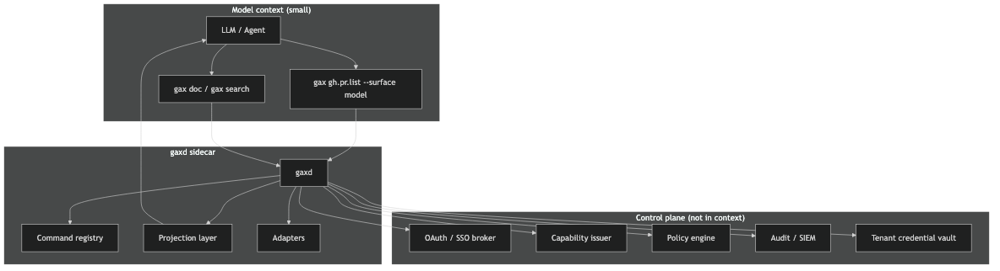

# GAX — Governed Agent eXecution

<p align="center">
  <strong>Your MCP gateway can't see <code>bash</code>. GAX governs both.</strong>
</p>

<p align="center">
  <a href="https://github.com/0sparsh2/GAX/actions/workflows/ci.yml"></a>
</p>

<p align="center">
  <a href="docs/QUICKSTART.md">Quickstart</a> ·
  <a href="docs/PLAN-2026H2.md">Plan</a> ·
  <a href="docs/PUBLIC_NARRATIVE.md">Narrative</a> ·
  <a href="docs/acsp/">Envelope spec</a> ·
  <a href="research/">Research</a> ·
  <a href="eval/">Evaluation</a>
</p>

---

## Table of contents

- [What is GAX?](#what-is-gax)
- [The gap GAX fills](#the-gap-gax-fills)
- [How it enforces](#how-it-enforces)
- [About the token argument](#about-the-token-argument)
- [Architecture](#architecture)
- [How it works](#how-it-works)
- [Evaluation](#evaluation)
- [Adapters](#adapters)
- [Installation](#installation)
- [How to use](#how-to-use)
- [Protocol & envelope](#protocol--envelope)
- [Repository structure](#repository-structure)
- [Research & benchmarks](#research--benchmarks)
- [Development](#development)
- [Roadmap](#roadmap)
- [License](#license)

---

## What is GAX?

**GAX** (Governed Agent eXecution) is a **governed execution layer for agent shell commands**. Agents get a command-line-shaped surface (`gax gh.pr.list --repo org/api`); **OAuth, policy, audit, and tenancy** live in a sidecar the model never sees.

The enforcement guarantee: **an agent can only name commands that already exist in the registry, every invoke carries a capability token checked before any adapter runs, and every invoke produces an `audit_id`.**

GAX **complements MCP** rather than competing with it. MCP servers become adapters behind stable GAX command names, so one policy file, one capability model, and one audit trail cover both your MCP calls and your shell calls.

| Component | Path | Description |
|-----------|------|-------------|
| **Reference implementation** | [`gax/`](gax/) | Python package: `gax` CLI + `gaxd` daemon (v0.4) |
| **Envelope spec** | [`docs/acsp/`](docs/acsp/) | Envelope v1, discovery, conformance tests |
| **Research hub** | [`research/`](research/) | MCP vs CLI analysis, diagrams, comparisons |
| **Evaluation harness** | [`eval/`](eval/) | Reproducible CLI / MCP / GAX measurements |
| **2026 H2 plan** | [`docs/PLAN-2026H2.md`](docs/PLAN-2026H2.md) | Repositioning + eval-integrity work |

---

## The gap GAX fills

MCP won the tool-calling standards war — [donated to the Linux Foundation's Agentic AI Foundation](https://chatforest.com/guides/mcp-ecosystem-2026-state-of-the-standard/) in Dec 2025, 97M downloads, 6,400+ registered servers. A [funded gateway category](https://www.truefoundry.com/blog/best-mcp-gateways) (Docker, Cloudflare, Kong, Bifrost, Lunar, MintMCP, TrueFoundry) now ships policy enforcement, audit, and OAuth for MCP traffic.

**Three things that stack does not cover:**

**1. The shell is ungoverned.** Every gateway above governs *MCP traffic*. But agents act overwhelmingly through `bash` — Claude Code's own architecture is file access + bash + MCP, and [the dominant setup pattern](https://okhlopkov.com/claude-code-setup-mcp-hooks-skills-2026/) mixes shell, skills, hooks, and MCP servers. An MCP gateway sees **none** of the shell half. [NVIDIA OpenShell](https://www.tigera.io/blog/nvidia-openshell-secures-the-agent-who-governs-the-fleet/) (GTC 2026) validates the problem but operates at the syscall layer, with no notion of *which registered command, under what capability, producing what audit record*.

**2. Governance is the acknowledged gap in the standard.** The [MCP 2026 roadmap names enterprise governance, audit trails, and SSO-integrated auth](https://blog.gitguardian.com/mcp-governance-framework/) as priorities it does not yet fully address. The ecosystem outgrew its security model: [30+ CVEs in Jan–Feb 2026](https://chatforest.com/guides/mcp-ecosystem-2026-state-of-the-standard/), including Asana's cross-tenant data leak, Smithery's path traversal exposing 3,243 apps, and tool-poisoning attacks.

**3. Tool poisoning has no purchase here.** Because the model can only invoke commands that already exist in [`gax/manifests/`](gax/manifests/), a poisoned tool *description* cannot introduce a new action. The action surface is fixed at deploy time, not negotiated at runtime.

| | MCP gateway | Shell sandbox | **GAX** |
|---|:---:|:---:|:---:|
| Governs MCP calls | ✅ | ❌ | ✅ |
| Governs shell commands | ❌ | ⚠️ syscall-level | ✅ registered commands |
| Capability checked pre-invoke | ✅ | ❌ | ✅ |
| Danger ceiling per credential | ❌ | ❌ | ✅ `read`/`write`/`destructive` |
| One audit trail across both | ❌ | ❌ | ✅ |
| Detects a tool changing after approval | ❌ | n/a | ✅ [pinned](#import-any-mcp-server--pinned) |

---

## How it enforces

GAX splits three planes:

| Plane | Visible to the model? | Responsibility |
|-------|------------------------|----------------|
| **Invocation** | Yes | Short commands: `gax <command> [args]` |
| **Control** | No | OAuth, vault, policy, capability mint/revoke |
| **Data** | Filtered | Envelope v1 JSON; `surface=model` truncates for the LLM |

**Trust boundary:** the model proposes *which registered command + args*; `gaxd` **enforces before any adapter runs** ([`executor.py`](gax/gax/executor.py)).

**Five invariants:**

1. **No arbitrary shell** — only registered commands (policy + allowlists). *This is the core guarantee.*
2. **Capability per invoke** — JWT or macaroon (`GAX_CAP` / `GAX-Capability` header); **fail closed**, with a **danger ceiling** (`--max-side-effect read|write|destructive`) so an allowlist edit cannot silently promote a read-only token into one that deletes things
3. **Uniform envelope** — every response: `ok`, `cmd`, `audit_id`, `data`, `meta`, optional `next` — so errors and audit correlation are the same shape across shell, MCP, and HTTP backends
4. **Lazy discovery** — `gax search` / `gax doc` / `gax schema`, never the full registry in context
5. **Composable plans** — `gax plan run workflow.yaml` (sequential + parallel), one envelope out

Fail-closed matters because the emerging enterprise best practice is *"if the audit write fails, the tool call should fail."* Capability checks, scope checks, and policy all run **before** the adapter — see the governance receipts in [SAMPLE_RUN](examples/agent_runs/SAMPLE_RUN/) (`policy_denied`, `scope_mismatch`, `expired_cap`, each with a correlated `audit_id`).

### See it stop something dangerous

```bash
export GAX_K8S_MOCK=1   # no cluster needed
export GAX_CAP="$(gax auth cap-mint --command k8s.pod.delete \
  --scope k8s:pods:write --max-side-effect read --raw)"

gax k8s.pod.delete --namespace prod --pod web-1
```

```json
{
  "ok": false,
  "error": {
    "kind": "policy_denied",
    "message": "side_effects 'destructive' exceeds capability ceiling 'read': k8s.pod.delete"
  },
  "audit_id": "aud_cef808f0fadd41e7"
}
```

The command **was** on that token's allowlist. It was refused anyway, before `kubectl` was
ever spawned, because the token's danger ceiling is `read` — **two independent things must
be wrong before something gets deleted.** The denial is audited with its arguments.

Covered by [26 adversarial tests](gax/tests/test_side_effect_ceiling.py) that attack the
check (expired token + destructive, scope mismatch, allowlisted-but-over-ceiling, wildcard
capability, shell metacharacters in pod names) rather than confirm the happy path.
Full walkthrough: [QUICKSTART](docs/QUICKSTART.md).

---

## About the token argument

**Earlier versions of this README led with token economics. That argument has largely expired, and we'd rather say so than have you discover it.**

When GAX started, naive MCP setups injected 44k+ tokens of tool schemas per session, and lazy discovery was a real differentiator. In 2026 the model vendors shipped the fix themselves:

- Anthropic's [Tool Search Tool](https://platform.claude.com/docs/en/agents-and-tools/tool-use/tool-search-tool) (`defer_loading: true`) — **~85% token reduction**, plus measured *accuracy* gains (Opus 4.5: 79.5% → 88.1% on MCP evals). OpenAI shipped defer-loading too.
- [Code Mode](https://www.getmaxim.ai/articles/code-execution-with-mcp-how-code-mode-cuts-agent-token-costs-by-90/) — up to **92.8% lower input tokens** at 500+ tools, 100% pass rate.

GAX's lazy discovery is now a platform feature, not a differentiator. **We don't claim a token advantage over a well-configured modern MCP setup.** On like-for-like tasks our own harness measures GAX at roughly **3.5× the tokens of raw CLI** — governance is not free, and we'd rather publish that number than a flattering one.

What survives is the enforcement layer: registered commands, capability-per-invoke, one audit trail spanning shell *and* MCP. Those are orthogonal to how tool schemas get loaded.

---

## Architecture



```text
┌──────────────┐     short commands      ┌──────────────┐
│  LLM / Agent │ ───────────────────────▶│  gax CLI     │
└──────────────┘                         └──────┬───────┘
                                                │ HTTP + GAX-Capability
                                                ▼
                                         ┌──────────────┐
                                         │    gaxd      │
                                         │  (sidecar)   │
                                         ├──────────────┤
                                         │ Registry     │
                                         │ Policy OPA   │
                                         │ Projection   │
                                         │ Audit / OTEL │
                                         └──────┬───────┘
                    ┌──────────────────────────┼──────────────────────────┐
                    ▼                          ▼                          ▼
              ┌──────────┐              ┌──────────┐              ┌──────────┐
              │ exec     │              │ mcp      │              │ http     │
              │ (gh, …)  │              │ bridge   │              │ OpenAPI  │
              └──────────┘              └──────────┘              └──────────┘
```

**Invocation flow:** [research/diagrams/png/sequence-invoke.png](research/diagrams/png/sequence-invoke.png) · [Full architecture doc](research/03-architecture.md)

| Component | Role |
|-----------|------|
| `gax` | Client CLI; discovery, auth, invoke, plans |
| `gaxd` | HTTP sidecar on `127.0.0.1:9477` (default) |
| `manifests/*.yaml` | Command registry: adapter, scopes, schemas |
| `~/.gax/` | Config, OAuth tokens, audit log, vault |

---

## How it works

1. **Register commands** in `gax/manifests/` (YAML) or generate from OpenAPI: `gax openapi generate spec.json`  
2. **Start sidecar:** `gaxd start`  
3. **Authenticate:** `gax auth login` (OAuth device flow) or `gax auth cap-mint` (dev JWT/macaroon)  
4. **Mint capability:** `export GAX_CAP="$(gax auth cap-from-oauth --export | sed 's/export GAX_CAP=//')"`  
5. **Discover (low tokens):** `gax search "pull requests"` → `gax doc gh.pr.list`  
6. **Invoke:** `gax gh.pr.list --repo octocat/Hello-World --surface model`  
7. **Audit:** every invoke gets `audit_id` in `~/.gax/audit.jsonl` (+ optional OTEL export)

**Example envelope (model surface):**

```json
{
  "v": 1,
  "ok": true,
  "cmd": "gh.pr.list@1.0.0",
  "audit_id": "aud_0b20bea710fe48fc",
  "surface": "model",
  "schema": "https://schemas.gax.dev/gh/pr.list/v1",
  "data": { "items": [ { "number": 42, "title": "…", "state": "OPEN" } ] },
  "meta": { "truncated": true, "row_count": 10, "duration_ms": 355 },
  "next": [
    {
      "cmd": "gh.pr.view",
      "args": { "repo": "octocat/Hello-World", "number": 42 },
      "reason": "inspect first PR in list"
    }
  ]
}
```

---

## Evaluation

Reproducible harness: **18 tasks** (happy path, errors, policy denial, truncation, multi-turn, plan failure, MCP bridge). Token counts use **tiktoken** (`cl100k_base`), not hardcoded estimates.

**Bias disclosure:** GAX is our implementation. We report **separate metrics** — no team-chosen weighted composite. See [eval/METHODOLOGY.md](eval/METHODOLOGY.md).

**Known defects, being fixed** ([tracked in the plan](docs/PLAN-2026H2.md#track-b--eval-integrity)) — we found these in our own review and are publishing them before the fix lands:

| # | Defect | Status |
|---|--------|--------|
| W1 | `cli` median was over 7 tasks, `gax` over 15; only 6 overlap — published ratio 1.3× understated GAX cost | **Fixed** — paired comparison; true ratio ~3.5× |
| W2 | Expected-failure rows rewritten to `ok=True` (32/150) made every modality report `success_rate: 1.0` | **Fixed** — split into `completion` / `expected_outcome` / `fail_closed` |
| W3 | Mock MCP (1 tool) tabled beside live MCP (26 tools) | Queued |
| W4 | `mcp_naive_43` is a borrowed constant + arithmetic, not a measurement | Queued |

| Modality | What it measures | Derivation |
|----------|------------------|------------|
| `cli` | Shell command + stdout in agent transcript | measured |
| `gax` | `gax doc` stub + envelope v1 | measured |
| `gax_mcp_bridge` | Envelope over MCP tool (schema not in prompt) | measured |
| `mcp_live` | Real `tools/list` size (`--live-mcp`) | measured |
| `mcp_naive_43` | Same work + ~44k schema tax | **modeled from Scalekit fixture** |

**Paired comparison** (the 6 tasks where both `cli` and `gax` produce a real row) — this is the honest like-for-like number:

| | median tokens |
|---|---:|
| cli | 80 |
| gax | 250 |
| **median ratio** | **~3.5×** (range 1.3×–5.9×) |

Per-task ratios and the excluded-task list are in [`eval/results/comparison.md`](eval/results/comparison.md). Live `gh` calls vary run to run, so expect ~3–3.5×; every paired task costs GAX more than CLI.

Governance properties are **by design, verified by test** — not experimental outcomes: `cli` emits no `audit_id` (0%) and `gax` emits one on every invoke (100%) because that is what each architecture *is*.

*Details:* [`eval/results/comparison.md`](eval/results/comparison.md) · **Extended (ablations + MCP catalog):** [`docs/ABLATIONS.md`](docs/ABLATIONS.md) · **Case study:** [eval/case_study/README.md](eval/case_study/README.md)

### Real LLM agent demo (operational receipts)

[`examples/agent_pr_triage.py`](examples/agent_pr_triage.py) runs an **actual LLM** with only `gax_search` / `gax_doc` / `gax_invoke` — no hardcoded tool catalog. The agent discovers commands at runtime, lists and inspects a live PR on `octocat/Hello-World`, summarizes review risk, and posts a draft comment via `demo.echo`. A deterministic **governance block** (policy deny, scope mismatch, expired capability) runs first; every invoke gets an `audit_id` verifiable in `~/.gax/audit.jsonl`.

**Proof run:** [examples/agent_runs/SAMPLE_RUN/](examples/agent_runs/SAMPLE_RUN/) (`20260518T193305Z` — Gemini 2.5 Flash-Lite, recovery probe + full agent loop, all audit IDs correlated). See [examples/README.md](examples/README.md).

```bash
pip install -r examples/requirements-agent.txt
# .env: GITHUB_TOKEN, GEMINI_API_KEY (or OPENAI_API_KEY / ANTHROPIC_API_KEY)
# optional: GEMINI_FALLBACK_KEY, GEMINI_MODEL=gemini-2.5-flash
python examples/agent_pr_triage.py
```

### Run evaluation locally

```bash
pip install -r eval/requirements.txt
cd gax && python3 -m venv .venv && source .venv/bin/activate
pip install -e ".[dev]"

# Put GITHUB_TOKEN in repo-root .env (gitignored) or export it
python ../eval/run_full.py
python ../eval/run_comparison.py --live-mcp
python ../eval/case_study/run_case_study.py
```

Independent references: [mcp_vs_cli_benchmarks_2026/report.md](mcp_vs_cli_benchmarks_2026/report.md) · [research/10-evaluation.md](research/10-evaluation.md)

---

## Adapters

GAX commands map to backends via the `adapter` field in each manifest.

| Adapter | Purpose | Example commands |
|---------|---------|------------------|
| **`exec`** | Wrap existing CLIs | `gh.pr.list`, `gh.pr.view` (uses `gh` subprocess; `GH_TOKEN` from OAuth) |
| **`mcp`** | One MCP tool per GAX command (schema stays in sidecar) | `mcp.github.list_pulls` |
| **`http`** | OpenAPI-generated GET calls | `pet.findpetsbystatus` (from `gax openapi generate`) |
| **`mock`** | Tests & demos without credentials | `demo.echo`, `kubectl.get.pods`, `aws.s3.list`, `jira.issue.get` |

### Adding a command

Create `gax/manifests/my.command.yaml`:

```yaml
command: my.command
version: "1.0.0"
description: What this command does
category: myapp
adapter: mock   # or exec | mcp | http
required_scopes:
  - myapp:read
side_effects: read
input_schema:
  type: object
  properties:
    id: { type: string }
output_schema:
  type: object
```

Restart `gaxd` or use `gax --local`.

### Use GAX from any MCP client

GAX ships as an MCP server, so Claude Code, Cursor, or any MCP client gets governed
shell execution with **zero GAX-specific integration**:

```bash
claude mcp add gax -- gax-mcp
# or, in .mcp.json / client config:
#   { "mcpServers": { "gax": { "command": "gax-mcp" } } }
```

It publishes exactly **three tools** — `gax_search`, `gax_doc`, `gax_invoke` — and keeps
the command registry behind them. A naive MCP server publishes one tool per capability,
so a 43-command registry costs ~44k tokens of schema before the first turn. GAX's surface
is **constant-size regardless of how many commands you register**, which is the same shape
as Anthropic's tool-search / `defer_loading` pattern — it composes with the platform fix
rather than competing with it.

The governance boundary is unchanged: `gax_invoke` calls the same executor as the CLI, so
capability, scope, and policy checks run **before** any adapter, and every call returns an
`audit_id`. A client cannot reach an unregistered command, and cannot bypass the capability
check by rephrasing — the model only ever proposes a command name plus args.

```bash
eval "$(gax auth cap-mint --command demo.echo --scope demo:echo --export)"
gax-mcp   # stdio JSON-RPC; normally launched by the client
```

### Import any MCP server — pinned

Point GAX at any of the ~6,400 MCP servers. It enumerates the tools and writes one
governed command per tool, **hashing each tool's contract**:

```bash
gax mcp import --id filesystem npx -y @modelcontextprotocol/server-filesystem /tmp
```

```text
  Imported 3 of 3 tool(s) from 'filesystem'

    ! mcp.filesystem.write_file    sha256:9c1a4e7b0f2d…
      mcp.filesystem.read_file     sha256:034f134f70ea…
      mcp.filesystem.list_dir      sha256:5e2b81cc94af…
```

The pin covers the tool's **name, description, and input schema** — the three things
that define what the model will be told to do. Before every invoke, the live tool is
hashed again. If it changed, the call fails closed with `pin_mismatch` and **the tool
is never called**.

That closes the tool-poisoning class behind several 2026 MCP CVEs: a server can
rewrite a tool's description to smuggle new instructions to the model, and a gateway
that proxies whatever the server currently advertises will forward it. Description is
in scope precisely because it's the injection vector — schema-only pinning misses it.

```bash
gax mcp verify        # re-check every pin against the live servers
```

**Import is a review step, not an approval.** Anything not clearly read-only is
imported as `destructive`, so your read-only capability can't invoke it until a human
reads what it does and raises the ceiling. Re-importing never silently re-pins a
changed tool — that would let tampering be laundered by re-running import.

### Smarter command search (Jev, optional)

`gax_search` is how an agent finds a command in its own words. Every miss costs a
round trip — search, junk, rephrase — re-sending the whole context each time, so
selection quality is where GAX can still save tokens.

Measured on [36 queries](eval/search_queries.yaml) — literal, synonym, intent, and
out-of-scope (where the right answer is "nothing") — hit@1:

| Backend | 22 commands | 87 commands\* | intent @ 87 | out-of-scope | p50 latency |
|---|---:|---:|---:|---:|---:|
| `keyword` (default) | 0.47 | 0.40 | **0.00** | 0.17 | <1 ms |
| `bm25` | 0.43 | — | — | — | <1 ms |
| **`jev`** | **1.00** | **1.00** | **1.00** | **1.00** | ~230–270 ms |

\*87 = bundled commands plus 65 imported from five real MCP servers (filesystem,
memory, everything, firecrawl, context7).

Keyword search gets *worse* as you import servers — their tools flood every query
with noise, and intent queries ("what broke in CI") drop to zero. Jev held at 100%.
Cost: ~57 Jev input tokens per registered command per search (~5k at 87 commands),
billed by TypeSafe, not added to your agent's context.

Lexical matching caps out near 50% once the agent stops using the manifest's exact
words ("remove a pod", "what broke in CI"). [Jev](https://docs.typesafe.ai/api) is a
selection model: it picks one option from a set you give it, with calibrated
probabilities, so it cannot invent a command name. GAX sends it the query and
candidate descriptions as a single `choice` question, plus an explicit "none"
option so out-of-scope requests come back empty instead of as a plausible wrong command:

```bash
export GAX_SEARCH=jev TYPESAFE_API_KEY=...   # JEV_API_KEY also accepted
python eval/run_search_eval.py --backend keyword --backend jev   # measure before relying on it
```

**Opt-in by design.** It sends the query and command descriptions to
api.typesafe.ai — never arguments, capabilities, or audit data. A key alone does not
turn it on. Any failure falls back to the default search, so an outage is never
worse than not enabling it. Search only orders names: whatever it ranks, invoking
still passes every capability and policy check. Low-confidence results tell the
agent to ask the user rather than guess.

### MCP bridge (single tool, by hand)

Expose a single MCP tool without loading all tool schemas into the agent:

```yaml
adapter: mcp
mcp:
  server_command: npx
  server_args: ["-y", "@modelcontextprotocol/server-github"]
  tool_name: list_pull_requests
```

```bash
export GITHUB_TOKEN=...
gax mcp.github.list_pulls --repo octocat/Hello-World --surface model
```

### OpenAPI → manifests

```bash
gax openapi generate examples/petstore-openapi.json --prefix pet --adapter mock
```

---

## Installation

**Requirements:** Python 3.10+

```bash
git clone https://github.com/0sparsh2/GAX.git
cd GAX/gax

python3 -m venv .venv
source .venv/bin/activate   # Windows: .venv\Scripts\activate
pip install -e ".[dev]"

# Optional: OS keychain for OAuth tokens
pip install -e ".[keyring]"
```

Then one command sets everything up — `~/.gax`, a 30-day **read-only** dev capability,
the sidecar, and a set of real commands:

```bash
gax init --profile k8s --profile github
gax k8s.pod.logs --pod web-1     # works immediately; no exports needed
gax doctor                       # diagnose config, capability, sidecar, backends
```

**Profiles** ship working commands so your first task isn't authoring YAML:

| Profile | Commands |
|---------|----------|
| `k8s` | `pod.list` `pod.logs` `pod.describe` `deployment.list` `service.list` · `deployment.restart` (write) · `pod.delete` `namespace.delete` (destructive) |
| `github` | `pr.list` `pr.view` `issue.list` `issue.view` `run.list` · `pr.comment` (write) · `pr.merge` (destructive) |

`gax profile list` shows them by danger level; `gax profile add <name>` installs into
`~/.gax/manifests/`, which survives package upgrades. **Installing grants nothing** —
`init` only adds a profile's *read* commands to your capability, so the write and
destructive ones stay refused until you mint for them deliberately.

Measured in a clean virtualenv with a fresh `$HOME`: install → 22 registered commands →
governed invoke → destructive refused → `doctor` all green in **~1 second**. Full
walkthrough: [QUICKSTART](docs/QUICKSTART.md).

---

## How to use

### 1. Start the sidecar

```bash
gaxd start                    # foreground
gaxd start --background       # background (pid in ~/.gax/gaxd.pid)
gaxd start --host 0.0.0.0     # hosted (put TLS on gateway)
```

### 2. Development capabilities (no OAuth)

```bash
export GAX_CAP="$(gax auth cap-mint \
  --command demo.echo \
  --command gh.pr.list \
  --command gh.pr.view \
  --scope demo:echo \
  --scope github:pull_request:read \
  --export | sed 's/export GAX_CAP=//')"
```

Macaroon-style cap: add `--macaroon`.

### 3. Production OAuth (GitHub)

1. Create a GitHub OAuth App with **Device Flow** enabled  
2. `export GAX_GITHUB_CLIENT_ID=Ov23li...`  
3. `gax auth login --tenant acme-corp`  
4. `export GAX_CAP="$(gax auth cap-from-oauth --export | sed 's/export GAX_CAP=//')"`

### 4. Discover & invoke

```bash
gax search "pull request"
gax doc gh.pr.list
gax schema gh.pr.list

gax gh.pr.list --repo octocat/Hello-World --limit 5 --surface model
gax gh.pr.view --repo octocat/Hello-World --number 1
gax demo.echo --message hello
```

### 5. Multi-step plans

```bash
gax plan run examples/plan-demo.yaml      # list PRs → view first
gax plan run examples/plan-parallel.yaml  # parallel demo.echo branches
```

### 6. Vault, compliance, policy

```bash
gax vault put api_key "secret-value" --tenant acme
gax vault get api_key --tenant acme

gax compliance export --format csv    # ~/.gax/exports/audit_soc2.csv
gax compliance export --format json

# Policy: gax/config/policy.yaml + optional OPA (config/policy.rego)
```

### 7. In-process (no gaxd)

```bash
gax --local demo.echo --message "no daemon"
```

### Environment variables

| Variable | Purpose |
|----------|---------|
| `GAX_CAP` | Capability JWT or macaroon |
| `GAX_HOST` / `GAX_PORT` | gaxd address (default `127.0.0.1:9477`) |
| `GAX_GITHUB_CLIENT_ID` | OAuth device flow |
| `GITHUB_TOKEN` | Used by `gh` exec adapter / MCP GitHub server |
| `GAX_HASHICORP_VAULT_ADDR` | Optional Vault backend for `gax vault` |
| `GAX_SPIFFE_ID` | Workload identity metadata in audit |
| `GAX_OTEL_STDOUT=1` | Emit OTEL-shaped logs to stdout |

### CLI reference

| Command | Description |
|---------|-------------|
| `gaxd start` / `stop` / `status` | Sidecar lifecycle |
| `gax auth login` | OAuth device flow |
| `gax auth cap-mint` | Mint dev capability |
| `gax auth cap-from-oauth` | Capability from stored OAuth |
| `gax auth status` | List stored tokens |
| `gax search` / `doc` / `schema` | Lazy discovery |
| `gax run <cmd>` | Explicit invoke |
| `gax <cmd>` | Shorthand for registered commands |
| `gax plan run <file>` | DAG-style workflows |
| `gax openapi generate` | OpenAPI → manifests |
| `gax vault put/get` | Tenant secrets |
| `gax compliance export` | Audit export |

HTTP API: `POST /invoke`, `GET /search?q=`, `GET /commands/{id}/doc`, `GET /health` — see [gax/README.md](gax/README.md).

---

## Protocol & envelope

| Doc | Topic |
|-----|--------|
| [docs/acsp/protocol.md](docs/acsp/protocol.md) | ACSP overview |
| [docs/acsp/envelope-v1.md](docs/acsp/envelope-v1.md) | Response envelope |
| [docs/acsp/discovery.md](docs/acsp/discovery.md) | search / doc / schema |
| [gax/schemas/envelope.v1.json](gax/schemas/envelope.v1.json) | JSON Schema |

**Surfaces:** `model` (truncated for LLM), `human` (TTY), `full` (automation).

**Exit codes:** `0` ok · `2` policy denied · `3` invalid cap · `4` not found · `5` adapter error · `6` pin mismatch

---

## Repository structure

```text
GAX/
├── README.md                 ← you are here
├── LICENSE
├── gax/                      ← Python reference implementation
│   ├── gax/                  ← package source (cli, daemon, adapters, …)
│   ├── manifests/            ← command registry (YAML)
│   ├── config/               ← OAuth providers, policy.yaml, policy.rego
│   ├── schemas/              ← envelope.v1.json
│   ├── examples/             ← plans, OpenAPI samples
│   └── tests/
├── docs/acsp/                ← protocol specification
├── eval/                     ← CLI vs MCP vs GAX benchmarks
│   ├── run_comparison.py
│   ├── run_full.py
│   └── results/
├── research/                 ← background, architecture, comparisons
│   └── diagrams/png/         ← architecture diagrams
├── mcp_vs_cli_benchmarks_2026/
│   ├── report.md             ← cited benchmark synthesis
│   └── results/*.json
└── deep-research/            ← phased research skill (outline → JSON → report)
```

---

## Research & benchmarks

| Resource | Description |
|----------|-------------|
| [research/README.md](research/README.md) | Research index |
| [research/01-background-mcp-vs-cli.md](research/01-background-mcp-vs-cli.md) | Why MCP vs CLI matters |
| [research/02-gax-proposal.md](research/02-gax-proposal.md) | GAX thesis |
| [research/05-comparison-matrix.md](research/05-comparison-matrix.md) | CLI / MCP / GAX matrix |
| [mcp_vs_cli_benchmarks_2026/report.md](mcp_vs_cli_benchmarks_2026/report.md) | Deep research report (Scalekit, Anthropic, Cloudflare) |
| [research/11-project-completion.md](research/11-project-completion.md) | Project summary |

Primary external benchmarks:

- [Scalekit — MCP vs CLI](https://www.scalekit.com/blog/mcp-vs-cli-use) (4×–32× tokens, 28% MCP timeouts)  
- [Anthropic — Code execution with MCP](https://www.anthropic.com/engineering/code-execution-with-mcp) (~98.7% token reduction example)  
- [Cloudflare — Code Mode](https://blog.cloudflare.com/code-mode-mcp/) (~1k vs ~1.17M tokens)

---

## Development

```bash
cd gax
source .venv/bin/activate
pip install -e ".[dev]"

pytest -q                           # unit tests
python ../eval/run_full.py          # tests + eval

# Regenerate diagram PNGs
cd ../research/diagrams
for f in *.mmd; do
  npx -y @mermaid-js/mermaid-cli@11 -i "$f" -o "png/${f%.mmd}.png" -b transparent
done
```

Validate deep-research JSON:

```bash
python ../deep-research/scripts/validate_json.py \
  -f ../mcp_vs_cli_benchmarks_2026/fields.yaml \
  -j ../mcp_vs_cli_benchmarks_2026/results/*.json
```

---

## Roadmap

| Phase | Status | Highlights |
|-------|--------|------------|
| **0** Prototype | Working | Envelope, gaxd, manifests, JWT caps |
| **1** Hardening | Working | OAuth, plans, macaroons, eval v2 |
| **2** Ecosystem | Mixed | MCP bridge (prototype); kubectl/aws/jira (stub) |
| **3** Enterprise | Mostly stub | Vault/SPIFFE/OPA hooks; compliance export (prototype) |

**Next up** — see [docs/PLAN-2026H2.md](docs/PLAN-2026H2.md):

1. ~~**GAX as an MCP server**~~ — **shipped**: `claude mcp add gax -- gax-mcp` ([above](#use-gax-from-any-mcp-client))
2. **Eval integrity** — W1/W2 done; W3 (mock/live split) and W4 (derivation labels) queued
3. **Real OPA** — policy-as-code is table stakes for the regulated-CI/CD wedge; Vault and SPIFFE stay out of the pitch until they're genuine

**Explicitly not doing:** competing on breadth of integrations. Composio, StackOne, and Docker's 200-image catalog win that permanently. GAX competes on depth of the enforcement guarantee for a narrow, high-stakes surface.

Full checklist: [research/06-implementation-roadmap.md](research/06-implementation-roadmap.md)

---

## License

[MIT](LICENSE)

---

## Contributing

See [CONTRIBUTING.md](CONTRIBUTING.md) — adapters, eval tasks, manifests, protocol change process.

**Quick links**

- [gax package README](gax/README.md) — install & command details  
- [ACSP spec](docs/acsp/index.md)  
- [Evaluation guide](research/10-evaluation.md)
