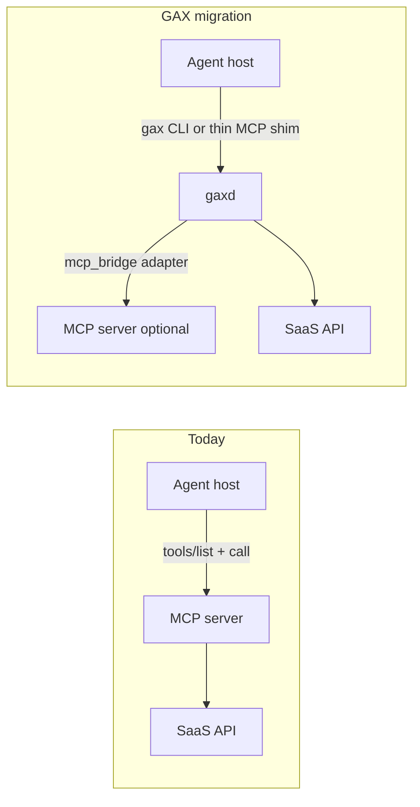

# GAX implementation & migration — deep research report

**Topic:** How agents use MCP and CLI today, how organizations migrate to GAX, infrastructure change, and adoption dynamics.

**Methodology:** Phased deep research per [RhinoInsight-style workflow](https://arxiv.org/html/2511.18743v1), adapted from [Weizhena/Deep-Research-skills](https://github.com/Weizhena/Deep-Research-skills). Ten structured items, web supplementation (May 2026), cross-read with this repo’s GAX prototype and prior transcript [9f86a5d8](9f86a5d8-614b-4eb2-b3cb-9ffe8deed9cd).

**Validator:** 10/10 JSON files PASS (100% field coverage).

---

## Table of contents

1. [Executive summary](#executive-summary)
2. [How MCP is used with agents today](#how-mcp-is-used-with-agents-today)
3. [How CLI is used with agents today](#how-cli-is-used-with-agents-today)
4. [The hybrid default](#the-hybrid-default)
5. [MCP optimization layer (not a protocol swap)](#mcp-optimization-layer-not-a-protocol-swap)
6. [Migration to GAX](#migration-to-gax)
7. [Infrastructure evolution](#infrastructure-evolution)
8. [Will people adapt?](#will-people-adapt)
9. [Recommended implementation sequence](#recommended-implementation-sequence)
10. [Per-item deep dives](#per-item-deep-dives)

---

## Executive summary

**MCP** is the default **cloud and SaaS** integration layer: remote HTTP servers, OAuth 2.1, marketplace/directory distribution, and growing host support (Claude Cowork, Managed Agents, Cursor, VS Code). **CLI/shell** remains the default **local inner loop** (git, tests, `gh`, docker) because it is mature, low-schema, and composable.

**GAX does not ask the industry to abandon MCP or CLI.** It asks them to stop exposing both **raw to the model** without a **governed execution plane** in between. Practically:

| Today | GAX role |
|-------|----------|
| MCP `tools/list` in context | Registry in `gaxd`; model uses `gax search` / `gax doc` |
| MCP `tools/call` | `gax <cmd>` → `/invoke` + capability JWT |
| Shell `gh …` | `gax gh.pr.list` via `exec` adapter + caps |
| OAuth in MCP client / vault | Tenant vault + per-invoke caps in `gaxd` |
| Ad hoc audit | `audit_id` on every envelope |

**Migration** is **wrap-first**: MCP servers and CLIs become **adapters** behind manifests; agents see one grammar. **Infrastructure** evolves from localhost `gaxd` (prototype) → team cluster → enterprise hosted control plane with OPA, vault, SIEM.

**Adoption:** Security/platform teams adopt first (12–24 months); ISVs follow customer demand; solo devs keep raw shell for local git unless mandated. MCP ecosystem gravity means GAX wins as **governance superset**, not replacement, for years.

---

## How MCP is used with agents today

### IDE and coding agents (Cursor, VS Code, Windsurf)

- **Config:** `.cursor/mcp.json` + global merge; marketplace one-click installs.
- **Transports:** stdio (local tools), Streamable HTTP (remote SaaS).
- **Agent loop:** Host injects tool definitions → model selects tool → JSON-RPC → result back into chat.
- **Auth:** Local servers inherit OS env; remote servers use OAuth 2.1 (PKCE, Protected Resource Metadata, CIMD).
- **Pain:** Upfront schema token cost; weak cross-tool audit; ambient env for stdio.

→ Full item: [IDE and coding agents with MCP](#ide-and-coding-agents-with-mcp)

### Claude platform (production)

Anthropic’s April 2026 framing: production agents need a **portable common layer** to remote systems—MCP. Patterns:

- **Remote servers** for web/mobile/cloud agents
- **Intent-grouped tools** (not 1:1 API mirrors)
- **Code Mode** (`search` + `execute`) for huge APIs (~1K tokens vs ~1M+ naive)
- **MCP Apps** and **elicitation** for UI and mid-flight user input
- **Vaults** for Managed Agents OAuth token lifecycle
- **Tool search** + **programmatic tool calling** for context efficiency

→ Full item: [Claude platform MCP production patterns](#claude-platform-mcp-production-patterns)

### Enterprise

- MCP servers on **ACA/K8s** with **Entra/Okta** OAuth 2.1
- Migration from API keys to OAuth for agent M2M
- Libraries (`mcp-oauth`) and IdP-native MCP servers (Okta)

→ Full item: [Enterprise MCP infrastructure](#enterprise-mcp-infrastructure)

---

## How CLI is used with agents today

- Built-in **shell** / `run_terminal_cmd` in Cursor Agent, Claude Code, CI agents.
- Model builds command strings; host runs in workspace sandbox.
- **Credentials:** `gh auth`, `AWS_PROFILE`, kubeconfig—**ambient** OS user authority.
- **Rules:** AGENTS.md, `.cursor/rules` teach `--json`, non-interactive flags.
- **Strengths:** Low schema overhead, pipes, decades of tooling.
- **Weaknesses:** No per-invoke attenuation, weak audit, arbitrary execution risk, unbounded stdout in context.

→ Full item: [Agent shell and CLI execution](#agent-shell-and-cli-execution)

---

## The hybrid default

Teams run **MCP for SaaS** + **shell for local** + manual rules to avoid duplicate paths (e.g. disable GitHub MCP, use `gh`). Unified sync tools (`agents-cli`) copy MCP/skills across Claude/Cursor/Codex. This is operational reality—not a failure mode.

**GAX target:** collapse hybrid **operations** (one auth story, one envelope, one discovery model) while keeping **adapter diversity** (MCP bridge + exec).

→ Full item: [Developer-local hybrid reality](#developer-local-hybrid-reality)

---

## MCP optimization layer (not a protocol swap)

| Pattern | What it does | Token impact (cited) |
|---------|----------------|----------------------|
| Tool search / defer_loading | Load tools on demand | ~85% reduction (50+ tools) |
| Programmatic tool calling | Filter/loop in sandbox | ~37% on complex flows |
| Code Mode | search/execute over OpenAPI | ~99.9% vs naive for huge APIs |

**Insight:** Cost is **exposure policy**. GAX encodes the same ideas natively: registry in `gaxd`, `gax search/doc`, `surface=model`, in-daemon `jq` / `plan run`.

→ Full item: [MCP context optimization layer](#mcp-context-optimization-layer)

---

## Migration to GAX

### From MCP deployments

**Phases:** inventory → shadow invoke (compare outputs) → pilot `gax`-only external actions → cap-based policy → retire direct MCP from clients (keep MCP Apps channel if needed).

→ Full item: [Migration path MCP deployments to GAX](#migration-path-mcp-deployments-to-gax)

### From CLI workflows

**Phases:** log top shell commands → manifest + `exec` adapter → AGENTS.md mandate → CI caps via OIDC → block raw `gh` in sandbox.

Prototype already maps `gh.pr.list` / `gh.pr.view` via exec adapter.

→ Full item: [Migration path CLI workflows to GAX](#migration-path-cli-workflows-to-gax)

### Thin MCP façade (bridge strategy)

Until hosts speak ACSP natively, ship an MCP server with **3 tools**: `gax_search`, `gax_doc`, `gax_invoke`—same strategy as Cloudflare Code Mode. Claude/Cursor unchanged; governance in `gaxd`.

---

## Infrastructure evolution

| Phase | Components | Who runs it |
|-------|------------|-------------|
| **0 (now)** | `gax`, `gaxd`, JWT caps, JSONL audit, YAML manifests | Developer laptop |
| **1** | OAuth device flow, keychain, macaroons, OPA, OTel, `plan run` | Team platform |
| **2** | MCP bridge, OpenAPI manifest gen, aws/kubectl manifests | Org platform |
| **3** | Multi-tenant vault, SPIFFE, hosted `gaxd`, compliance export | Enterprise SRE/security |

**Network pattern:** agents → `gaxd` → SaaS APIs; laptops **no longer** hold production tokens for wrapped commands.

→ Full item: [GAX infrastructure evolution](#gax-infrastructure-evolution)

---

## Will people adapt?

| Stakeholder | Likely behavior | Timeline |
|-------------|-----------------|----------|
| **Security / compliance** | Push caps + audit; fund hosted `gaxd` | 12–24 mo pilots |
| **Platform engineering** | Standardize agent permissions | 18–36 mo |
| **ISVs** | Ship manifests if customers ask; keep MCP for directory | Follow enterprise RFPs |
| **Individual developers** | Resist unless blocked; keep git shell | Indefinite for local |
| **MCP ecosystem** | Continues growing; GAX rides on top | 5+ years coexistence |

**Drivers:** OAuth already approved for MCP; token bills; SOC2 gaps on shell history; need one audit stream across Cursor + Claude + custom bots.

**Blockers:** MCP marketplace gravity; MCP Apps/elicitation not in GAX v0.1; another daemon to run; incomplete manifest coverage → shadow hybrid returns.

**Historical rhyme:** Kubernetes did not replace `docker run` on laptops overnight; OAuth did not kill API keys in one year. GAX follows **enterprise mandate first, developer convenience second**.

→ Full item: [Adoption dynamics and organizational change](#adoption-dynamics-and-organizational-change)

---

## Recommended implementation sequence

Aligned with [research/06-implementation-roadmap.md](../research/06-implementation-roadmap.md) and this research:

1. **Harden prototype auth** — device OAuth, keychain, macaroon caps (Phase 1 roadmap).
2. **MCP bridge adapter** — wrap existing servers; thin MCP shim for Cursor/Claude.
3. **Manifest pipeline** — OpenAPI → manifest; top-20 commands from shell log analysis.
4. **Enterprise pilot kit** — OPA bundle template, OTel audit export, cap self-service doc.
5. **Publish ACSP spec** — envelope v1 + capability format (already in repo schemas).
6. **Do not** wait for IDE native support—shell + thin MCP is enough for v1 adoption.

---

## Per-item deep dives

### IDE and coding agents with MCP

See `results/IDE_and_coding_agents_with_MCP.json`. Key: mcp.json merge, stdio vs HTTP, auto tool discovery, OAuth 2.1 for remote, token cost from schema dump.

### Claude platform MCP production patterns

See `results/Claude_platform_MCP_production_patterns.json`. Key: remote servers, vaults, plugins+skills, Code Mode, tool search, programmatic calling.

### Agent shell and CLI execution

See `results/Agent_shell_and_CLI_execution.json`. Key: ambient auth, rules files, low schema / high risk.

### Developer-local hybrid reality

See `results/Developer_local_hybrid_reality.json`. Key: intentional MCP off + gh on; agents-cli sync.

### Enterprise MCP infrastructure

See `results/Enterprise_MCP_infrastructure.json`. Key: Entra/Okta, ACA hosting, OAuth 2.1 M2M migration.

### MCP context optimization layer

See `results/MCP_context_optimization_layer.json`. Key: exposure policy patterns GAX should match or exceed.

### Migration path MCP deployments to GAX

See `results/Migration_path_MCP_deployments_to_GAX.json`. Key: dual-run, mcp_bridge, phased cutover.

### Migration path CLI workflows to GAX

See `results/Migration_path_CLI_workflows_to_GAX.json`. Key: exec adapter, top-N commands, CI caps.

### GAX infrastructure evolution

See `results/GAX_infrastructure_evolution.json`. Key: gaxd tiers, vault, OPA, hosted control plane.

### Adoption dynamics and organizational change

See `results/Adoption_dynamics_and_organizational_change.json`. Key: three constituencies, timelines, coexistence.

---

## Related repo docs

- [research/09-implementation-migration.md](../research/09-implementation-migration.md) — condensed living doc + migration diagram
- [research/02-gax-proposal.md](../research/02-gax-proposal.md) — thesis
- [research/03-architecture.md](../research/03-architecture.md) — planes and sequence
- Raw JSON: `gax_implementation_migration_2026/results/`
