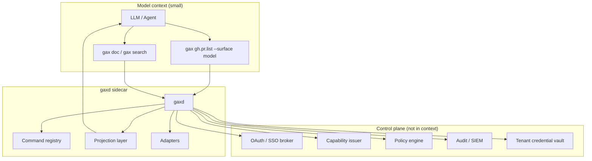
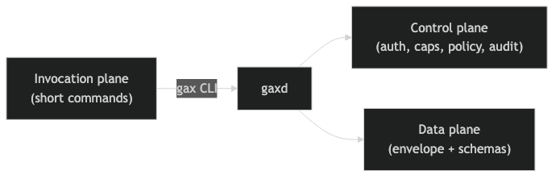
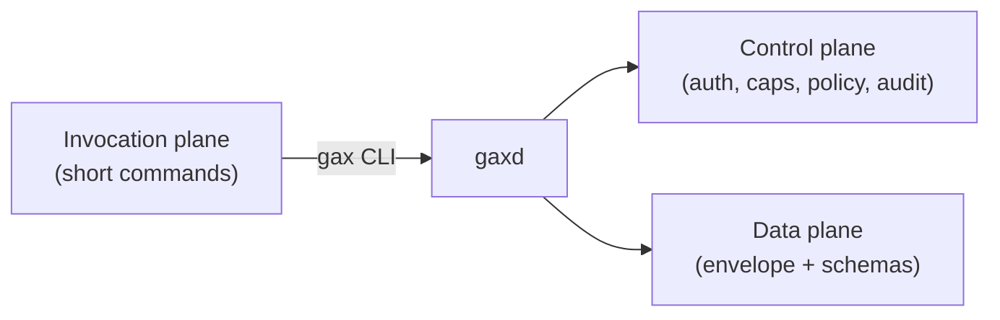
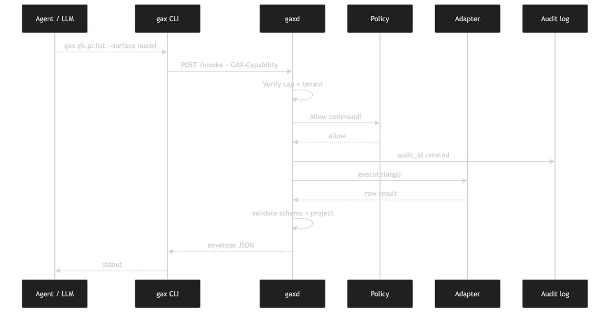
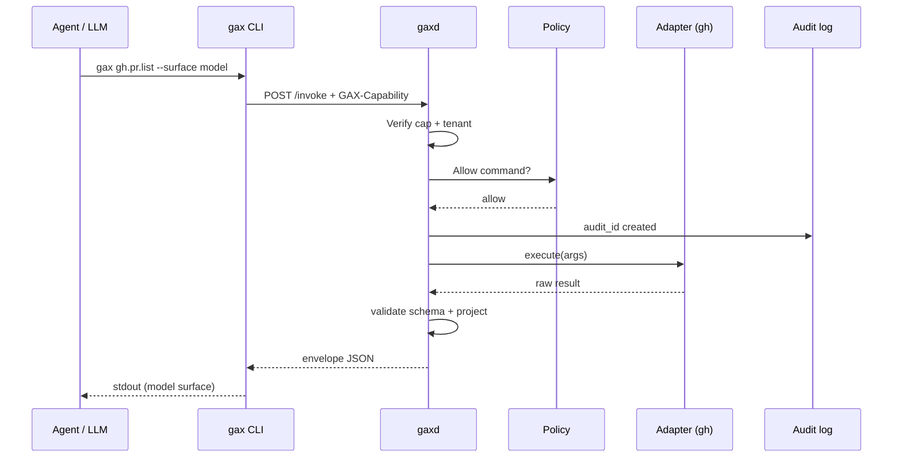

# GAX architecture

## System context




Source: [diagrams/architecture.mmd](./diagrams/architecture.mmd)

## Three planes





Source: [diagrams/planes.mmd](./diagrams/planes.mmd)

## Invocation sequence





Source: [diagrams/sequence-invoke.mmd](./diagrams/sequence-invoke.mmd)

## Prototype layout (this repo)

```
gax/
  gax/           # Python package
    cli.py       # gax entrypoint
    daemon.py    # gaxd HTTP server
    envelope.py
    caps.py
    registry.py
    projection.py
    policy.py
    audit.py
    adapters/
  manifests/     # Command manifests (YAML)
  schemas/       # JSON Schema
```

## Adapter model

Each command manifest declares:

- `command` / `version`
- `adapter` — `exec`, `http`, `mock`
- `required_scopes` — cap must include
- `input_schema` / `output_schema`
- `side_effects` — `read` | `write` | `destructive`

MCP servers can be wrapped as adapters without exposing MCP tool schemas to the model.
