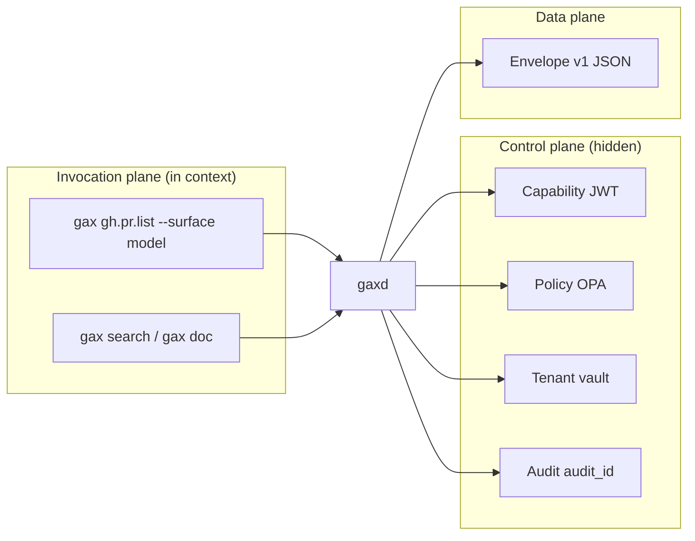

# Implementation & migration — how the world moves to GAX

Living summary of deep research (`gax_implementation_migration_2026/`). Complements [02-gax-proposal.md](./02-gax-proposal.md) (what) and [06-implementation-roadmap.md](./06-implementation-roadmap.md) (build phases).

## One-sentence model

**Agents keep familiar short commands; organizations add `gaxd` so OAuth, caps, audit, and structured envelopes happen outside the model context.**

## How agents use MCP today

| Layer | What happens |
|-------|----------------|
| **Config** | `mcp.json` (Cursor), Claude connectors, marketplace installs |
| **Discovery** | Host loads tool names + JSON Schema into context (unless tool search / Code Mode) |
| **Invoke** | JSON-RPC `tools/call` over stdio or HTTP |
| **Auth** | OAuth 2.1 remote; env inheritance local |
| **Output** | Unstructured text or JSON blob back into chat |

**Production pattern (Anthropic, 2026):** remote MCP + intent-grouped tools + vaults for cloud agents + optional Code Mode / tool search for token control.

**Enterprise pattern:** HTTP MCP on K8s/ACA + Entra/Okta; API keys → OAuth migration.

## How agents use CLI today

| Layer | What happens |
|-------|----------------|
| **Config** | AGENTS.md, `.cursor/rules`, skills |
| **Discovery** | Rules say “use `gh --json`” — no schema in context |
| **Invoke** | Shell tool runs arbitrary string |
| **Auth** | Ambient OS user (`gh auth`, AWS profile) |
| **Output** | stdout/stderr text; model parses |

**Dominant for:** git, tests, builds, local docker, quick `gh` when MCP disabled for tokens.

## Hybrid reality

Most teams **already hybrid**: MCP for Linear/Sentry/browser; shell for git/npm/gh. Manual cost control (turn off GitHub MCP). GAX targets **unifying ops**, not picking a winner.

## What changes with GAX

### MCP → GAX

1. Keep MCP server running (optional).
2. Register each tool (or intent-group) as a **manifest command**.
3. `mcp_bridge` adapter forwards `/invoke` to `tools/call`.
4. Agent config: **one** MCP server with `gax_invoke` / `gax_search` **or** shell-only `gax` CLI.

### CLI → GAX

1. Log agent shell usage → top commands.
2. **exec adapter** manifest per command (`gh.pr.list` prototype).
3. Mint caps: `--command gh.pr.list --ttl 300`.
4. Block raw `gh` in CI sandbox when policy requires.

## Infrastructure timeline

See [diagrams/migration-phases.mmd](./diagrams/migration-phases.mmd).

| Stage | Deployment | Audience |
|-------|------------|----------|
| Prototype | `gaxd` on localhost:9477 | This repo / early adopters |
| Team | Shared dev cluster `gaxd` | Platform team |
| Enterprise | Hosted HA `gaxd`, vault, SIEM | Security-mandated agents |
| Ecosystem | ISV-published manifest bundles | Same as MCP directory today |

**Does not require** IDE vendors on day one — thin MCP shim + shell invocation suffice.

## Will people adapt?

**Yes, unevenly.**

- **Will adapt quickly:** regulated enterprises already approving OAuth MCP; need `audit_id` and cap revocation; FinOps on token spend.
- **Will adapt slowly:** solo devs, local git, ad-hoc shell.
- **Will not fully adapt:** arbitrary shell for exploration — and that is acceptable if policy scopes “external effect” commands through GAX only.

**Coexistence:** MCP protocol remains the ISV→host wire format; GAX becomes the **organizational policy layer**—similar to API gateways sitting in front of REST.

## Alignment with prototype code

| Research claim | Code today |
|----------------|------------|
| `gax` CLI | `gax/gax/cli.py` |
| `gaxd` `/invoke` | `gax/gax/daemon.py` |
| Caps | `gax/gax/caps.py` |
| exec adapter | `gax/gax/adapters/exec_adapter.py` |
| MCP bridge | Roadmap Phase 2 |
| OAuth login | Roadmap Phase 1 (`auth login` stub) |

## Deep research artifacts

| Artifact | Path |
|----------|------|
| Outline | `gax_implementation_migration_2026/outline.yaml` |
| Field schema | `gax_implementation_migration_2026/fields.yaml` |
| Per-item JSON | `gax_implementation_migration_2026/results/*.json` |
| Full report | `gax_implementation_migration_2026/report.md` |

## Next research threads

- Elicitation / MCP Apps mapping into GAX extension
- Cap mint UX (self-service portal patterns)
- Benchmark: GAX thin MCP vs native MCP vs raw `gh` on fixed agent tasks
- ISV interview template for manifest publishing incentives
